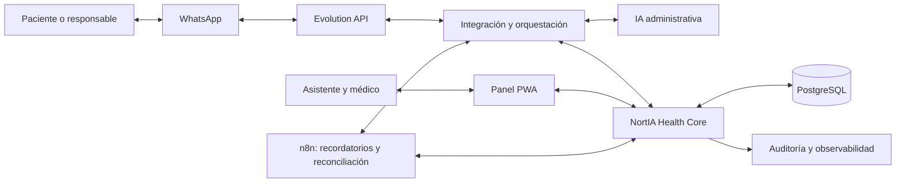

# Arquitectura propuesta

> Diseño extraído de los documentos de planificación. No describe servicios desplegados ni contratos de API implementados.

## Organización

Monolito modular API-first con PWA responsive. El estado crítico del negocio reside en NortIA Health Core y su base de datos. n8n orquesta integraciones y automatizaciones; la IA interpreta y conversa.

Diagrama conceptual: la distribución exacta de webhooks y llamadas entre backend, gateway y n8n se define durante la foundation.

## Responsabilidades

| Componente | Responsabilidad |
| --- | --- |
| Core | Pacientes, responsables, citas, disponibilidad, reglas, permisos, estados, auditoría y seguimiento |
| IA | Conversación, intención y clasificación; solicitar acciones a través del Core |
| n8n | Workflows, recordatorios, tareas, alertas, integraciones y reconciliación |
| PWA | Operación diaria y configuración |
| Gateway WhatsApp | Envío/recepción y eventos de conversación |
| Base de datos | Persistencia del negocio |

La IA no escribe directamente en la agenda. n8n no es la fuente de verdad del estado crítico.

## Módulos de dominio previstos

Identidad y tenants; pacientes y responsables; servicios y reglas; agenda y disponibilidad; conversaciones; agente administrativo; auditoría; automatizaciones. Pagos, seguimiento ampliado, KPIs, multiagenda e inventario crecen sobre esa base.

Los nombres de tablas, endpoints, payloads y estados completos siguen pendientes de diseño. `audit_event` aparece expresamente en el plan de desarrollo, sin esquema definido.

## Infraestructura recomendada en las fuentes

| Recurso | Uso previsto | Control propuesto |
| --- | --- | --- |
| GitHub | Monorepo, documentación, issues, PRs y CI/CD | Privacidad, ramas protegidas, revisión y secrets externos |
| Railway | API, workers, PostgreSQL y servicios persistentes | Staging y producción separados; backups y variables por ambiente |
| Netlify | Frontend/PWA y previews | Preview revisable por PR |
| n8n | Automatizaciones y webhooks | Workflows versionados, logging y acceso protegido |
| Evolution API | Gateway de WhatsApp | Aislamiento, rotación de tokens y cola de mensajes |
| Cloudflare | DNS y protección perimetral | Rate limiting y restricciones de acceso donde correspondan |

El framework, lenguaje, ORM, proveedor/modelo de IA y mecanismo concreto de colas no están seleccionados en las fuentes. La modalidad de conexión de WhatsApp y sus condiciones operativas también requieren validación.

## Integridad y seguridad previstas

- Locks y reservas temporales para impedir double booking.
- Roles, permisos por tenant y auditoría desde la fase inicial.
- Consentimiento y mínimos datos enviados al modelo.
- Secrets fuera del repositorio y tokens rotables.
- Backups y prueba de restauración.
- Logging, alertas y reconciliación de eventos.
- Escalamiento humano para excepciones y situaciones sensibles.

Estas son exigencias de diseño, no evidencias de cumplimiento ni controles ya verificados.

## Integraciones pendientes

Doctoralia se considera un canal externo hasta confirmar capacidades de integración. El plan propone reconciliación manual o semiautomática mientras no haya una API suficiente. La pasarela de pagos, las reglas de prepago y el comportamiento ante fallos se deben especificar.

Fuentes: plan operativo, secciones 2–3 y 8; plan de desarrollo, secciones 1–4.

